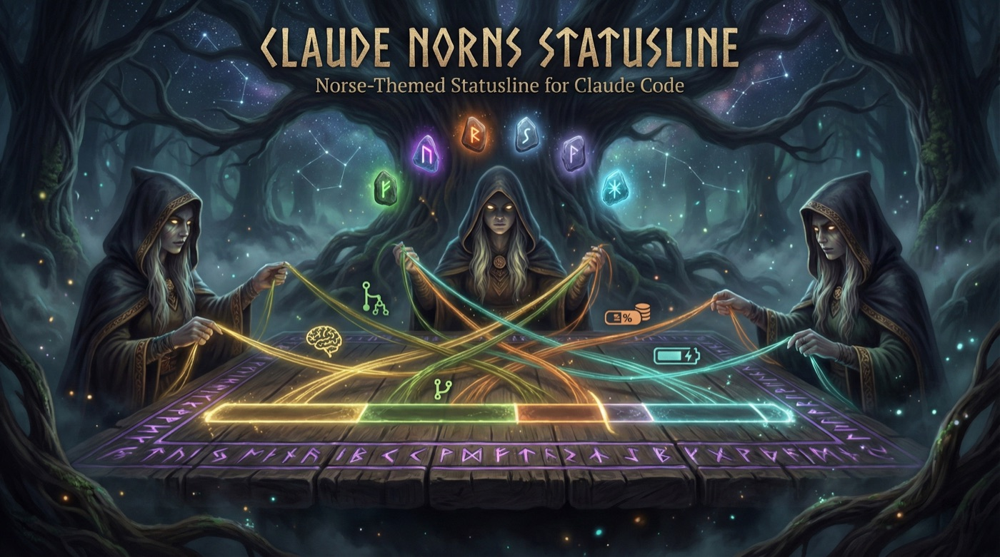

# claude-norns-statusline

<p align="center">
  
</p>

A Norse-themed statusline plugin for [Claude Code](https://docs.anthropic.com/en/docs/claude-code). Displays model info, git status, context window usage, session costs, and OAuth usage tracking — all in a beautiful, configurable terminal statusline.

Zero runtime dependencies. Single bundled file. Under 70ms render time.

```
 󰊛 Opus 4.6  main  ██████░░░░ 62%  $1.23 · 45K tok  S:42% 3h12m · W:67%
```

## Features

- **6 Norse themes** — Yggdrasil, Bifrost, Ragnarok, Valhalla, Mist, Jotunheim
- **3 rendering styles** — Powerline arrows, minimal pipes, capsule pills
- **12 segments** — model, git, context, session, usage, block, daily, metrics, version, tmux, directory, custom
- **Smart truncation** — priority-based segment dropping when terminal is narrow
- **Nerd Font + text fallback** — works with or without patched fonts
- **5 progress bar styles** — block `█░`, classic `━─`, shade `▓░`, dot `●○`, pipe `┃┊`
- **Rainbow shimmer** — time-based HSV animation while Claude is active
- **OAuth usage tracking** — session and weekly API usage (auto-discovers credentials)
- **File-based caching** — configurable TTLs for git, OAuth, and transcript data
- **Truecolor support** — 24-bit hex colors with automatic fallback
- **Debug mode** — `--debug-stdin` dumps raw Claude Code data for troubleshooting

## Installation

### npm (recommended)

```bash
npm install -g claude-norns-statusline
```

### npx (no install)

Use directly in your Claude Code config — npx will fetch it on first run:

```bash
npx claude-norns-statusline@latest --theme=yggdrasil
```

### From source

```bash
git clone https://github.com/danjuls/claude-norns-statusline.git
cd claude-norns-statusline
npm install && npm run build
```

## Setup

Add to your Claude Code settings at `~/.claude/settings.json`:

```json
{
  "statusLine": {
    "type": "command",
    "command": "npx claude-norns-statusline@latest --theme=yggdrasil --style=powerline"
  }
}
```

Or if installed globally / from source:

```json
{
  "statusLine": {
    "type": "command",
    "command": "claude-norns-statusline --theme=bifrost --style=capsule"
  }
}
```

Restart Claude Code and the statusline should appear at the bottom of your terminal.

## Themes

Preview all themes at once:

```bash
echo '{}' | npx claude-norns-statusline --show-themes
```

| Theme | Description | Aesthetic |
|-------|-------------|-----------|
| **yggdrasil** | World Tree (default) | Deep forest bark, moss green, ancient gold |
| **bifrost** | Rainbow Bridge | Aurora cyan, violet, shimmering rose |
| **ragnarok** | Fire & Twilight | Ember orange, blood red, molten gold |
| **valhalla** | Hall of the Chosen | Silver light, ice blue, warm gold |
| **mist** | Niflheim Fog | Deep slate, drifting lavender, pale cyan |
| **jotunheim** | Frozen Realm | Deep navy, glacier cyan, frost white |

## Styles

| Style | Separators | Example |
|-------|------------|---------|
| **powerline** | Arrow glyphs `` | `segment1segment2` |
| **minimal** | Pipe separators `│` | `segment1 │ segment2` |
| **capsule** | Rounded pills `` | `segment1 segment2` |

Use `--charset=text` for ASCII fallback if your font doesn't support Nerd Font glyphs.

## Reading the Statusline

Here's what each part of the statusline shows:

```
 󰊛 Opus 4.6  HEAD ?9  ██████░░░░ 50%  $4.43 · 138K tok  S:29% · W:26% · Max 5x
 ─────────── ──────── ──────────────── ────────────────── ──────────────────────────
   model       git        context           session                usage
```

| Segment | Example | What it means |
|---------|---------|---------------|
| **model** | `Opus 4.6` | The active Claude model |
| **git** | `HEAD ?9` | Current branch (or HEAD if detached), `?9` = 9 untracked files, `+3` = staged, `!2` = modified |
| **context** | `██████░░░░ 50%` | How much of Claude's context window (conversation memory) is used. When it hits 100%, older messages get compressed to make room |
| **session** | `$4.43 · 138K tok` | Total API cost and tokens consumed this session |
| **usage** | `S:29% · W:26%` | `S:` = 5-hour usage block consumed, `W:` = 7-day rolling usage. These are your rate limit quotas from Anthropic |

The context bar is the most useful at-a-glance indicator — it tells you how deep into a conversation you are before context compression kicks in.

## Segments

Segments are the building blocks of the statusline. Each gathers its own data and renders independently.

| Segment | Default | Priority | Description |
|---------|---------|----------|-------------|
| **model** | on | 100 | Active Claude model name |
| **git** | on | 90 | Branch, dirty/staged/untracked counts, ahead/behind |
| **context** | on | 80 | Context window usage with progress bar |
| **session** | on | 70 | Session cost and token count |
| **usage** | on | 60 | OAuth API session/weekly usage percentages |
| **block** | off | 50 | 5-hour usage block tracking |
| **daily** | off | 45 | Daily aggregate cost/tokens |
| **metrics** | off | 40 | Message count and session duration |
| **version** | off | 30 | Claude Code version |
| **tmux** | off | 20 | Tmux session name |
| **directory** | off | 10 | CWD with fish-style path abbreviation |
| **custom** | off | 5 | Output from a user-defined shell command |

Higher priority segments are kept when the terminal is too narrow — lower priority ones are dropped first.

### Enabling/disabling segments

Via CLI flags:

```bash
# Disable a segment
--no-git
--no-usage

# Enable a disabled-by-default segment
--metrics=true
--directory=true
```

Via config file:

```json
{
  "segments": {
    "git": { "enabled": false },
    "metrics": { "enabled": true },
    "custom": { "enabled": true, "options": { "command": "hostname -s" } }
  }
}
```

## Configuration

Settings are resolved in this order (highest priority first):

1. **CLI flags** — `--theme=ragnarok --style=capsule --no-git`
2. **Environment variables** — `NORNS_THEME`, `NORNS_STYLE`, `NORNS_CHARSET`, `NORNS_BAR_STYLE`, `NORNS_SHIMMER`, `NORNS_OAUTH`
3. **Project config** — `.claude-norns-statusline.json` in current directory
4. **User config** — `~/.claude/claude-norns-statusline.json`
5. **XDG config** — `$XDG_CONFIG_HOME/claude-norns-statusline/config.json`
6. **Defaults**

### Example config file

```json
{
  "theme": "bifrost",
  "style": "powerline",
  "charset": "nerd",
  "barStyle": "block",
  "barWidth": 10,
  "oauth": true,
  "segments": {
    "model": { "enabled": true, "priority": 100 },
    "git": { "enabled": true, "priority": 90 },
    "context": { "enabled": true, "priority": 80 },
    "session": { "enabled": true, "priority": 70 },
    "usage": { "enabled": true, "priority": 60 },
    "metrics": { "enabled": true, "priority": 40 },
    "directory": { "enabled": true, "priority": 10 }
  }
}
```

### CLI reference

| Flag | Description | Default |
|------|-------------|---------|
| `--theme=NAME` | Theme name | `yggdrasil` |
| `--style=NAME` | `powerline`, `minimal`, or `capsule` | `powerline` |
| `--charset=NAME` | `nerd` or `text` | `nerd` |
| `--bar-style=NAME` | `block`, `classic`, `shade`, `dot`, or `pipe` | `block` |
| `--shimmer` | Rainbow animation while Claude is active | `false` |
| `--oauth=false` | Disable OAuth usage fetching | `true` |
| `--no-SEGMENT` | Disable a segment | — |
| `--SEGMENT=true` | Enable a segment | — |
| `--show-themes` | Preview all themes and exit | — |
| `--debug-stdin` | Dump stdin JSON to `~/.cache/claude-norns-statusline/` | — |

## Shimmer Effect

Enable a subtle glow animation with `--shimmer`:

```json
{
  "statusLine": {
    "type": "command",
    "command": "npx claude-norns-statusline@latest --theme=bifrost --shimmer"
  }
}
```

Two light bands sweep across the statusline at different speeds, brightening your theme colors as they pass — like a reflection on brushed metal. A gentle background pulse adds a slow "breathing" effect. All theme colors are preserved; the glow just lifts brightness toward white as it passes.

The effect works automatically — Claude Code refreshes the statusline ~every 150ms while active, and each refresh produces the next animation frame. When Claude goes idle, the animation naturally pauses. No background processes needed.

## OAuth Usage Tracking

The usage segment shows your 5-hour session and 7-day rolling API usage percentages. It auto-discovers your OAuth token from three sources (tried in order):

1. **`~/.claude/.credentials.json`** — flat file credentials
2. **macOS Keychain** — `Claude Code-credentials` entry (most common on macOS)
3. **`CLAUDE_CODE_OAUTH_TOKEN` env var** — manual override

If you're logged into Claude Code normally, it should work automatically. Disable with `--oauth=false` if you don't need it or are using an API key.

## Debugging

If segments aren't showing, add `--debug-stdin` to your command to inspect what Claude Code sends:

```bash
# Add to your statusLine command temporarily
claude-norns-statusline --debug-stdin

# Then check the dump
cat ~/.cache/claude-norns-statusline/debug-stdin.json
```

## Requirements

- **Node.js** >= 18
- **Claude Code** with statusline support
- **Nerd Font** (optional, use `--charset=text` for ASCII fallback)
- **Truecolor terminal** recommended (iTerm2, Ghostty, Kitty, Alacritty, WezTerm)

## License

MIT
